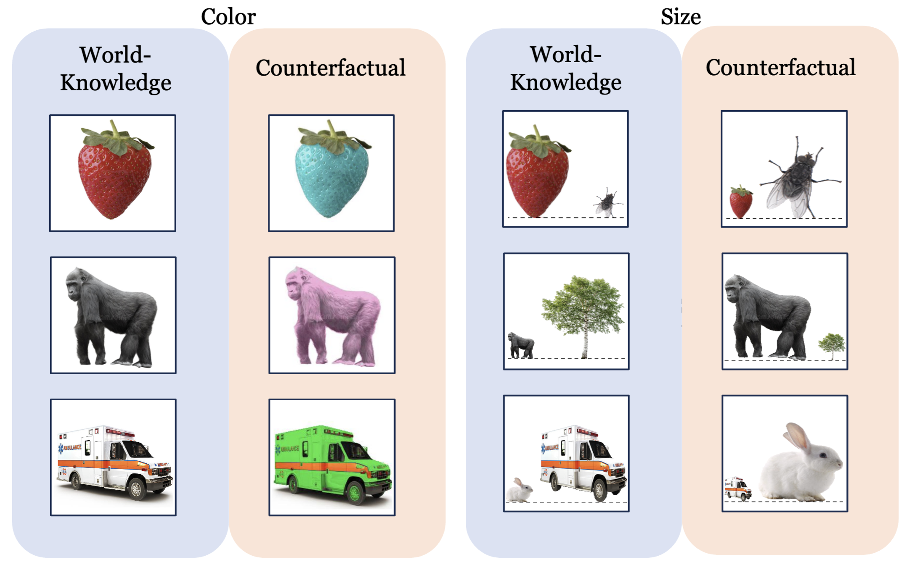
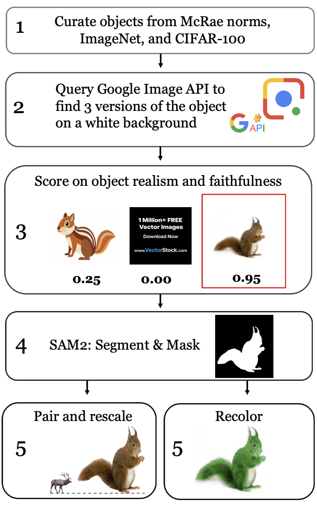

# Pixels Versus Priors: Controlling Knowledge Priors in Vision-Language Models through Visual Counterfacts

This repository contains code for analyzing multimodal large language models (MLLMs) using counterfactual images. It includes tools for evaluating model accuracy, probing internal activations, computing attention shifts, and applying steering vector interventions. 

<div align="center">
  
</div

---

## Quick Start
[📖 Paper](https://arxiv.org/abs/2505.17127) | [🤗 Hugging Face Dataset](https://huggingface.co/datasets/mgolov/Visual-Counterfact)

Download the dataset from HuggingFace: 

```python
from datasets import load_dataset

dataset = load_dataset("mgolov/Visual-Counterfact")

df_color = dataset["color"].to_pandas()
df_size = dataset["size"].to_pandas()
```


---

## Analysis

### `test_MLLMs.py`
Runs inference on MLLMs using the Visual CounterFact dataset. Outputs model responses to different prompt-image combinations.

### `early_decoding.py`
Implements early decoding to track model predictions across layers. Used to visualize when the model shifts from relying on world knowledge to visual input.

### `get_hidden_states.py`
Extracts hidden activations from selected layers in the model. **This must be run before computing steering vectors.**

### `task_vectors_inference_CF_WK.py`
Applies steering vectors to shift predictions from counterfactual (CF) answers to world knowledge (WK). Requires hidden states from `get_hidden_states.py`.

### `task_vectors_inference_WK_CF.py`
Applies steering vectors to shift predictions from world knowledge (WK) to counterfactual (CF) answers. Requires hidden states from `get_hidden_states.py`.

### `attention_mass.py`
Analyzes changes in attention mass between image and text tokens, comparing prompt-based versus intervention-based steering.

## Creating Visual CounterFact

<div align="center">
  
</div>


---

## Usage Notes

- Run `get_hidden_states.py` before either of the `task_vectors_inference_*.py` scripts.
- All scripts assume access to the Visual CounterFact dataset and compatible MLLMs.
